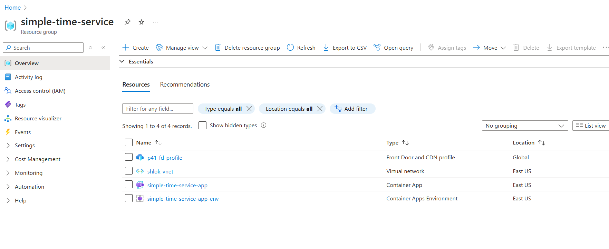
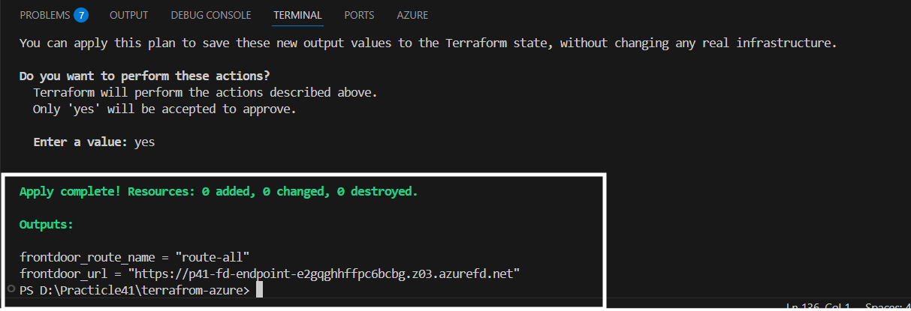

---

# 🛠️ Terraform Deployment – `simple-time-service` on Azure

Hello 👋,

As part of the Particle41 DevOps Challenge, I’ve completed the infrastructure setup to deploy the `simple-time-service` Node.js container app on **Azure Container Apps** using **Terraform**.

This README documents every step you need to understand, verify, and even redeploy the infrastructure.

---

## 📁 Project Structure

Here’s the folder layout for this Terraform setup under the `terraform-azure` directory:

```
terraform-azure/
├── .terraform/                  # Terraform backend cache
├── modules/                     # Any reusable modules (optional for now)
├── main.tf                      # Core infrastructure logic
├── outputs.tf                   # Final output (e.g., endpoint URL)
├── providers.tf                 # Azure provider setup
├── terraform.tfstate*           # State files (generated after apply)
├── terraform.tfvars             # Variable values
├── variables.tf                 # Input variable definitions
```

---

## ✅ Prerequisites

Please ensure the following tools are available on your local machine before running Terraform:

- [Azure CLI](https://learn.microsoft.com/en-us/cli/azure/install-azure-cli)
- [Terraform](https://developer.hashicorp.com/terraform/downloads)
- Azure subscription with sufficient permissions (Contributor or higher)

---

## 🚀 Step-by-Step Setup Guide

### 1️⃣ Login to Azure

We’ll first authenticate your Azure CLI to access your subscriptions:

```bash
az login
```

This will open a browser for authentication. Once done, list and choose your desired subscription using:

```bash
az account list
az account set --subscription "<YOUR_SUBSCRIPTION_ID>"
```

This step is **mandatory** for Terraform to deploy resources into the correct subscription.

---

### 2️⃣ Navigate into Terraform Directory

Go to the working directory:

```bash
cd terraform-azure/
```

---

### 3️⃣ Initialize Terraform

This will download required providers and initialize the working directory:

```bash
terraform init
```

---

### 4️⃣ Review the Infrastructure Plan

Run the following to review what will be created:

```bash
terraform plan
```

Please double-check the resources and locations before continuing.

---

### 5️⃣ Deploy the Infrastructure

Now, provision everything using:

```bash
terraform apply
```

When prompted, type `yes`.

Terraform will now create:

- Resource Group
- Virtual Network (VNet)
- Azure Container App Environment
- Container App hosting the Node.js service
- Optional: Azure Front Door (for global endpoint)

---

## ✅ Final Azure View

Once deployed, the Azure portal will show a resource group named `simple-time-service` with the following resources:

| Name                          | Type                        | Region    |
|-------------------------------|-----------------------------|-----------|
| `simple-time-service-app`     | Container App               | East US   |
| `simple-time-service-app-env` | Container App Environment   | East US   |
| `shlok-vnet`                  | Virtual Network             | East US   |
| `p41-fd-profile`              | Front Door and CDN profile  | Global    |


_Refer to the screenshot I attached earlier for visual confirmation._



---

## 🌐 Accessing the App

Once the deployment is complete, the app will be publicly accessible. The URL will be printed in the Terraform output (defined in `outputs.tf`). You can also find the link in the Azure Portal under the **Container App's “Ingress” tab**. and you can also get the URL once the terraform apply command finished.



